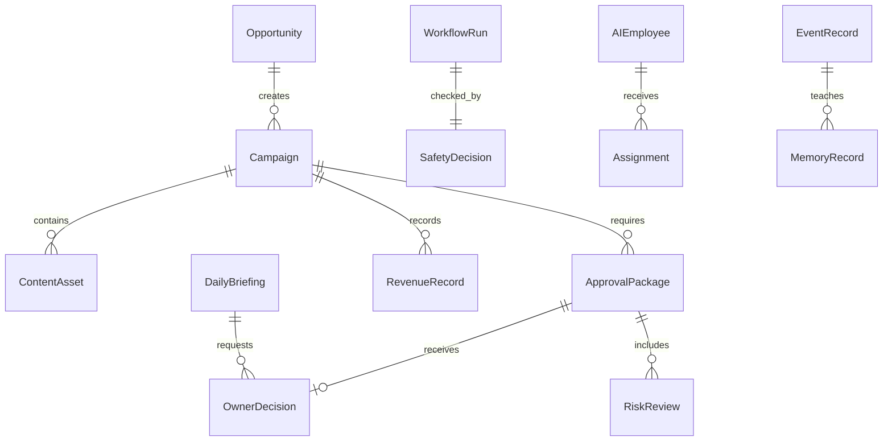

# Data and Event Model

## 0. Purpose

Phase1-B needs a normalized local model before additional revenue workflows are implemented. This document defines the target data and event contracts. It is not a database migration and does not enable external communication.

## 1. Model Rules

- Every execution-like record must include mode and safety decision fields.
- Revenue numbers must include `valueType`: `actual`, `mock`, `forecast`, `sample`, or `unconnected`.
- Provider states must not imply connection unless verified in a future approved phase.
- Approval records are durable audit records, not UI-only state.
- Event records are append-only in concept, even if implementation starts with localStorage.

## 2. Core Models

| Model | Required Fields | Notes |
| --- | --- | --- |
| `OwnerDecision` | `decisionId`, `createdAt`, `decisionType`, `targetId`, `status`, `reason`, `decidedBy`, `decidedAt` | Captures approval, rejection, change request, or emergency decision |
| `SafetyDecision` | `safetyDecisionId`, `createdAt`, `actionType`, `workflowType`, `providerId`, `mode`, `allowed`, `reason`, `severity`, `emergencyStop` | Mirrors central Safety Engine result |
| `AIEmployee` | `employeeId`, `name`, `gender`, `department`, `title`, `status`, `allowedActions`, `prohibitedActions`, `requiredApprovals`, `experience`, `successRate`, `improvementRate` | Source for workforce display and assignment |
| `Assignment` | `assignmentId`, `employeeId`, `workflowId`, `taskId`, `role`, `status`, `createdAt`, `completedAt`, `qualityScore` | Links employee to work |
| `Opportunity` | `opportunityId`, `createdAt`, `source`, `title`, `channel`, `audience`, `valueType`, `expectedRevenue`, `confidence`, `riskLevel`, `status` | No external source unless explicitly future-approved |
| `Campaign` | `campaignId`, `opportunityId`, `title`, `channel`, `objective`, `targetAudience`, `status`, `mode`, `ownerApprovalRequired` | Converts opportunity into a package |
| `ContentAsset` | `assetId`, `campaignId`, `assetType`, `title`, `body`, `format`, `status`, `createdByEmployeeId`, `qaStatus`, `externalActionRequested` | Blog, SNS, video, visual, proposal |
| `ApprovalPackage` | `approvalId`, `workflowId`, `campaignId`, `requestedByEmployeeId`, `summary`, `assets`, `budgetEstimate`, `riskLevel`, `legalChecklist`, `brandChecklist`, `safetyDecisionId`, `ownerDecisionId`, `status` | Required before any external-facing intent |
| `RevenueRecord` | `revenueRecordId`, `campaignId`, `value`, `currency`, `valueType`, `source`, `recordedAt`, `verifiedBy`, `notes` | Must clearly distinguish actual and mock |
| `BudgetEstimate` | `budgetId`, `workflowId`, `amount`, `currency`, `costType`, `valueType`, `limitImpact`, `ownerApprovalRequired` | Estimate only unless future spend phase exists |
| `RiskReview` | `riskReviewId`, `targetId`, `reviewerEmployeeId`, `riskLevel`, `legalFlags`, `brandFlags`, `claimFlags`, `recommendation`, `createdAt` | Aoi/Kazu style review |
| `ProviderStatus` | `providerId`, `displayName`, `configurationState`, `verificationState`, `executionState`, `displayLabel`, `lastCheckedAt`, `notes` | Phase1-B labels should be unverified/mock/disabled |
| `WorkflowRun` | `workflowRunId`, `workflowType`, `mode`, `status`, `contextPresent`, `safetyDecisionId`, `startedAt`, `completedAt`, `resultMode` | Execution functions must have context and guard |
| `EventRecord` | `eventId`, `eventType`, `occurredAt`, `actorType`, `actorId`, `targetType`, `targetId`, `payload`, `safetyDecisionId` | Target append-only event ledger |
| `MemoryRecord` | `memoryId`, `sourceEventId`, `category`, `summary`, `lesson`, `tags`, `createdAt`, `reuseScore` | Learning layer |
| `DailyBriefing` | `briefingId`, `date`, `generatedByEmployeeId`, `summary`, `risks`, `ownerDecisionsNeeded`, `nextActions`, `dataCompleteness` | Aegis output |

## 3. Event Names

| Event | Actor | Target | Required Payload |
| --- | --- | --- | --- |
| `owner.command.created` | Owner | Opportunity or Workflow | command text, intent, risk hint |
| `opportunity.created` | AIEmployee/System | Opportunity | source, channel, valueType, confidence |
| `opportunity.ranked` | AIEmployee | Opportunity | score, reason, assumptions |
| `campaign.created` | AIEmployee | Campaign | objective, channel, audience |
| `content.asset.created` | AIEmployee | ContentAsset | assetType, title, status |
| `risk.review.completed` | AIEmployee | RiskReview | riskLevel, flags, recommendation |
| `approval.package.created` | AIEmployee | ApprovalPackage | summary, budget, risk |
| `owner.approval.granted` | Owner | ApprovalPackage | decision reason |
| `owner.approval.rejected` | Owner | ApprovalPackage | rejection reason |
| `safety.decision.blocked` | SafetyEngine | WorkflowRun | actionType, reason, severity |
| `safety.decision.allowed` | SafetyEngine | WorkflowRun | actionType, scope, mode |
| `workflow.mock.completed` | System | WorkflowRun | result summary, resultMode |
| `workflow.blocked` | System | WorkflowRun | reason, safetyDecisionId |
| `revenue.record.created` | AIEmployee/System | RevenueRecord | value, valueType, source |
| `employee.assignment.created` | Aegis/Ren | Assignment | employeeId, taskId, role |
| `employee.performance.updated` | System | AIEmployee | successRate, improvementRate, reason |
| `memory.record.created` | Chika/System | MemoryRecord | lesson, sourceEventId |
| `briefing.daily.created` | Aegis | DailyBriefing | summary, risks, decisions |
| `emergency.stop.enabled` | Owner/System | SafetyPolicy | reason |
| `production.request.blocked` | SafetyEngine | WorkflowRun | reason, requestedAction |

## 4. Relationships

## 5. Storage Direction

Short term:

- Keep localStorage for Phase1-B MVP.
- Add records in a normalized shape before building new UI.
- Avoid new external storage.

Later:

- Replace scattered localStorage keys with a single local event ledger abstraction.
- Add migration helpers.
- Add import/export without secrets.
- Add provider adapters only after real API criteria are approved.

## 6. Common Model Standard

Every Phase1-B model must define the following fields or policies:

| Field | Requirement |
| --- | --- |
| `id` | Stable unique identifier for the record |
| `requiredFields` | Fields required to create a valid record |
| `optionalFields` | Fields that may be omitted without breaking validity |
| `status` | Record lifecycle state |
| `createdAt` | Creation timestamp |
| `updatedAt` | Update timestamp when mutable |
| `relations` | Explicit links to other models |
| `sourceOfTruth` | Owner of authoritative state |
| `valueType` | `ACTUAL`, `FORECAST`, or `MOCK` where the model contains values |
| `validationRules` | Fail-closed checks |
| `securityClassification` | `PUBLIC`, `INTERNAL`, `CONFIDENTIAL`, or `SECRET` |
| `localStoragePolicy` | Whether Phase1-B may store the record locally |
| `futureDatabaseNotes` | Migration and hardening notes |

Security rules:

- `SECRET` must never be stored in LocalStorage.
- `CONFIDENTIAL` must not be stored raw in LocalStorage.
- Phase1-B may store only mock values, public values, internal UI cache, or reference IDs for sensitive concepts.

## 7. Campaign and Revenue Enums

`Campaign.type`:

- `CORE_MEDIA`
- `SHORT_TERM_SERVICE`

`RevenueRecord.revenueType`:

- `AD_REVENUE`
- `AFFILIATE_REVENUE`
- `SERVICE_REVENUE`
- `PRODUCT_REVENUE`
- `OTHER_REVENUE`

`RevenueRecord.valueType`:

- `ACTUAL`
- `FORECAST`
- `MOCK`

`ACTUAL`, `FORECAST`, and `MOCK` are mutually exclusive inside one `RevenueRecord`.

## 8. Detailed High-Risk Models

### ApprovalRequest

Required fields:

- `approvalRequestId`
- `actionType`
- `targetType`
- `targetId`
- `requestedBy`
- `requestedAt`
- `expiresAt`
- `estimatedCost`
- `riskLevel`
- `requiredChecks`
- `status`

Governance:

- `sourceOfTruth`: application state, not LocalStorage alone.
- `securityClassification`: `INTERNAL`.
- `localStoragePolicy`: UI cache only.
- `validationRules`: target and action must match the later `ApprovalDecision`.

### ApprovalDecision

Required fields:

- `approvalDecisionId`
- `approvalRequestId`
- `ownerId`
- `decision`
- `decisionReason`
- `decisionAt`
- `expiresAt`
- `nonce`
- `checksumPlaceholder`
- `safetyDecisionId`
- `consumedAt`
- `revokedAt`

Governance:

- One `ApprovalDecision` can be consumed only once.
- LocalStorage `approval=true` must never authorize execution.
- Expired, consumed, revoked, mismatched, or malformed decisions fail closed.
- `sourceOfTruth`: future server-side approval store; Phase1-B uses mock proof semantics only.
- `securityClassification`: `CONFIDENTIAL`.
- `localStoragePolicy`: reference ID or mock proof only.
- `futureDatabaseNotes`: signed approval token, server-side nonce, replay prevention.

### WorkflowRun

Required fields:

- `workflowRunId`
- `workflowId`
- `campaignId`
- `attemptNo`
- `runSequence`
- `idempotencyKey`
- `correlationId`
- `previousRunId`
- `retryOfRunId`
- `startedAt`
- `completedAt`
- `status`
- `failureReason`
- `safetyDecisionId`
- `approvalDecisionId`
- `valueType`

Governance:

- `idempotencyKey` prevents duplicate processing.
- `correlationId` links Opportunity -> Campaign -> WorkflowRun -> Task -> ContentAsset -> Approval -> PublishPrepared -> RevenueRecord.
- `sourceOfTruth`: event ledger and workflow state.
- `securityClassification`: `INTERNAL`.
- `localStoragePolicy`: mock workflow records allowed.

### RevenueRecord

Required fields:

- `revenueRecordId`
- `revenueType`
- `valueType`
- `amount`
- `currency`
- `campaignId`
- `opportunityId`
- `channel`
- `contentAssetId`
- `affiliateOfferId`
- `affiliateLinkId`
- `clickId`
- `conversionId`
- `referrer`
- `sourcePlatform`
- `occurredAt`
- `recordedAt`
- `evidenceType`
- `evidenceReference`
- `attributionWindow`
- `confidenceLevel`

Governance:

- `valueType` is mutually exclusive.
- Affiliate attribution uses `affiliateOfferId`, `affiliateLinkId`, `clickId`, `conversionId`, `referrer`, `sourcePlatform`, and `attributionWindow`.
- `sourceOfTruth`: manual Owner record in Phase1-B; future provider or server record later.
- `securityClassification`: `INTERNAL` or `CONFIDENTIAL` depending on evidence.
- `localStoragePolicy`: mock and non-sensitive manual summary only.

### EmployeePerformance

Required fields:

- `employeeId`
- `taskId`
- `workflowRunId`
- `campaignId`
- `contentAssetId`
- `revenueRecordId`
- `contributionType`
- `contributionWeight`
- `qualityScore`
- `successRate`
- `improvementRate`

Governance:

- Links employee work to tasks, workflow, content, and revenue.
- `sourceOfTruth`: event ledger-derived score.
- `securityClassification`: `INTERNAL`.
- `localStoragePolicy`: mock score allowed.

### AuditLog

Required fields:

- `auditLogId`
- `eventName`
- `actorType`
- `actorId`
- `targetType`
- `targetId`
- `correlationId`
- `idempotencyKey`
- `occurredAt`
- `payloadHashPlaceholder`
- `previousHashPlaceholder`
- `appendOnly`
- `valueType`

Governance:

- Phase1-B does not fully implement tamper resistance.
- Shape must allow future migration to an append-only database.
- `sourceOfTruth`: future append-only audit store.
- `securityClassification`: `INTERNAL`.
- `localStoragePolicy`: mock audit entries only.

## 9. Exact Event Catalog

Each event must include `eventName`, `producer`, `consumers`, `payload`, `idempotencyKey`, `correlationId`, `occurredAt`, `actor`, `target`, `valueType`, `auditLogRequired`, `retryable`, and `failureHandling`.

| eventName | producer | consumers | payload | auditLogRequired | retryable | failureHandling |
| --- | --- | --- | --- | --- | --- | --- |
| `opportunity.created` | Opportunity Engine | Campaign Engine, Aegis | opportunityId, campaignType, channel, valueType | true | false | reject duplicate idempotencyKey |
| `campaign.created` | Campaign Engine | Workflow Engine, Revenue Command Center | campaignId, opportunityId, type, KPIs | true | false | fail closed on missing type |
| `campaign.approved` | Owner/Approval | Workflow Engine | campaignId, approvalDecisionId | true | false | require Safety re-check |
| `workflow.started` | Workflow Engine | Event Ledger, Aegis | workflowRunId, workflowId, attemptNo | true | true | block duplicate idempotencyKey |
| `workflow.completed` | Workflow Engine | Performance Recorder, Memory | workflowRunId, resultMode | true | false | record final state once |
| `workflow.failed` | Workflow Engine | Aegis, Owner screen | workflowRunId, failureReason | true | true | allow retry with new attemptNo |
| `task.assigned` | Aegis/Ren | AI Employee, Task board | taskId, employeeId, role | true | false | reassign if employee inactive |
| `task.completed` | AI Employee | Workflow Engine, Performance | taskId, outputRef, qualityScore | true | false | reopen if required output missing |
| `content.generated` | AI Employee | QA, Approval Package | contentAssetId, artifactType, campaignId | true | true | regenerate with same correlationId |
| `legal.reviewed` | Aoi | Approval Package, Aegis | riskReviewId, riskLevel, legalFlags | true | false | block if review missing |
| `quality.reviewed` | Fumi/Akari | Approval Package | qaId, brandFlags, status | true | false | return to rework |
| `approval.requested` | Ren | Owner, Aegis | approvalRequestId, targetId, actionType | true | false | expire if not decided |
| `owner.approved` | Owner | Safety Engine, Approval Package | approvalDecisionId, nonce, expiresAt | true | false | consume once only |
| `owner.rejected` | Owner | Workflow Engine, Aegis | approvalDecisionId, decisionReason | true | false | stop workflow |
| `publish.prepared` | Ren | Owner screen, Event Ledger | publishPreparedId, manualSteps, blockedActions | true | false | block automatic publish |
| `revenue.recorded` | Performance Recorder | Dashboard, Memory | revenueRecordId, revenueType, valueType | true | false | split mixed valueType |
| `employee.evaluated` | Performance Recorder | AI Workforce Registry | employeeId, score, sourceEventId | true | false | skip if source missing |
| `emergency_stop.activated` | Owner/Safety Engine | All services | reason, activatedAt | true | false | stop all execution-like actions |
| `emergency_stop.released` | Owner | Safety Engine | reason, releasedAt | true | false | require Owner confirmation |
| `budget.threshold_reached` | Budget Guard | Owner, Aegis | threshold, budgetState | true | false | show alert |
| `budget.exceeded` | Budget Guard | Safety Engine, Owner | limitType, budgetState | true | false | auto stop |

`idempotencyKey` must prevent duplicate processing of the same event. `correlationId` must trace Opportunity -> Campaign -> WorkflowRun -> Task -> ContentAsset -> Approval -> PublishPrepared -> RevenueRecord.
