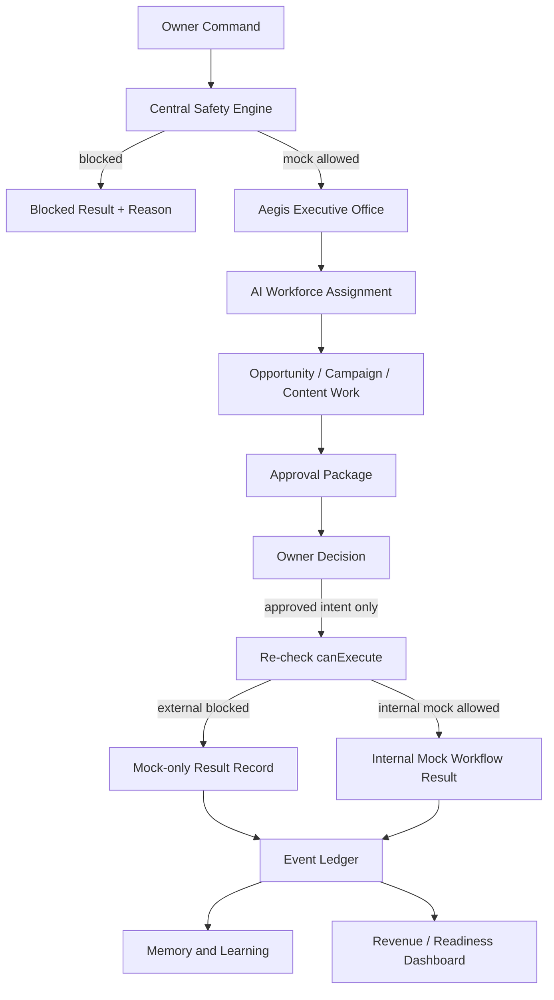

# KEVIRIO V6 Architecture

## 0. Safety Declaration

This document is a design artifact for Phase1-B. It does not enable Production Mode, does not add API execution, and does not change source code behavior. Phase1-B implementation must keep Phase1-A rules as the highest priority:

- Development Mode remains the only executable mode.
- Mock Only remains the default and required operating state.
- External API calls, publish/send/webhook/production actions, and connection tests stay blocked until explicit future criteria are met.
- `canExecute` in the central Safety Engine is the final authority for execution.
- Budget Guard is Owner intent confirmation only. It is not execution permission.
- Emergency Stop must override all other approvals.

## 1. Current System Summary

KEVIRIO currently has a React front-end with local state persistence, a mock-only safety foundation, and modular panels for operations, revenue, workflows, memory, approvals, analytics, and API settings. The system is ready for Phase1-B design and limited implementation planning, but not for real external operations.

Observed reusable assets:

- Home and operations surfaces: `OperatorOverview`, `HomeCommandCenter`, `OperationCommandCenter`.
- API safety surfaces: `APIControlCenter`, `BudgetGuardModal`, `ErrorBoundary`.
- Revenue and media surfaces: `AffiliateHub`, `CampaignOS`, `ContentStudio`, `SocialRevenuePanel`, `Analytics`, `OpportunityEngine`.
- Workflow surfaces: `WorkflowAutomation`, `WorkEngine`, `WorkCommand`, `ApprovalCenter`.
- Intelligence and memory surfaces: `TrendIntelligence`, `BusinessMemory`, `AICEO`, `AIAssistant`.
- Safety services: `safetyEngine`, `workflowEngine`, `aiOrchestrator`, `apiRegistry`, `connectionEngine`.
- Domain services: `campaignEngine`, `opportunityEngine`, `pipelineEngine`, `socialRevenueEngine`, `memoryEngine`, `missionBrain`, `agentEngine`, `agentCompany`.

Main technical debt:

- Multiple localStorage-backed stores exist without a unified event ledger.
- Revenue, task, workflow, and approval objects are related conceptually but not yet normalized.
- Mock status labels have been corrected for Phase1-A, but future implementation must keep display state and execution state tied to the same source of truth.
- AI employee definitions exist as UI/data concepts, but full operating rules, promotion rules, and revenue accountability are not yet centralized.
- Approval packages are not yet formalized as durable records with evidence, risk, budget, and post-decision audit fields.

Revenue blockers:

- No real provider connection is allowed yet.
- No validated attribution model exists for SNS, affiliate, blog, service proposals, or revenue events.
- No standardized content package moves from opportunity to draft to approval to result.
- No real budget consumption or provider-side cost telemetry exists.
- No production publish, send, webhook, or external automation may run in Phase1-A or early Phase1-B.

## 2. Target Layer Model

| Layer | Name | Responsibility | Main Inputs | Main Outputs | Phase1-B Priority |
| --- | --- | --- | --- | --- | --- |
| 1 | Owner Control | Human decisions, approvals, emergency policy | Owner command, approval decision, budget intent | Approved or rejected intent | P0 |
| 2 | Safety Governance | Execution permission, mode enforcement, budget gate, emergency stop | Action context, mode, provider, workflow type | Allow/block decision with reason | P0 |
| 3 | Aegis Executive Office | Owner briefing, AI workforce coordination, risk escalation | Metrics, tasks, approvals, memory | Daily brief, escalation, assignment proposal | P0 |
| 4 | AI Workforce | 50 role-based AI employees with responsibilities and limits | Assignments, backlog, opportunities | Drafts, analysis, proposals, QA findings | P0/P1 |
| 5 | Revenue Operating Core | Revenue workflows, campaign orchestration, pipeline state | Opportunity, campaign, content, channel | Revenue task, approval package, result record | P0 |
| 6 | Content Production | Blog, SNS, video, creative, affiliate content planning | Topic, product, keyword, trend, brand rule | Draft asset, checklist, mock schedule | P0/P1 |
| 7 | Approval and Risk | Owner approval queue, legal/brand/budget checks | Draft package, cost estimate, risk flags | Approval record, rejection reason, change request | P0 |
| 8 | Data and Events | Normalized local data model and event ledger | All domain events | Durable records, audit trail, metrics | P0 |
| 9 | Memory and Learning | Decision journal, performance learning, reusable knowledge | Result event, owner feedback, QA result | Updated memory, employee score, playbook | P1 |
| 10 | Provider Gateway | Future external API adapter boundary | Approved external intent | Blocked in Phase1-A, future provider call | P2/P3 |
| 11 | Observability | Readiness, risk, revenue, execution visibility | Event ledger, safety decisions | Dashboard metrics and alerts | P1 |

## 3. Data Flow

## 4. Source Boundary

Phase1-B implementation should preserve the current boundaries:

- UI components render state and collect Owner intent.
- Services produce mock-only calculations, workflow state, and guard decisions.
- Data files define initial mock data and static registries.
- No component may directly perform external communication.
- `workflowEngine` and any future execution service must require context and must call `canExecute`.

## 5. Future Real API Criteria

Real API connection may only be considered after all conditions are satisfied:

1. Owner explicitly approves a post-Phase1-B connection phase.
2. Provider credentials are managed outside the repository and never shown in UI or logs.
3. A provider adapter is added behind the central Safety Engine.
4. `canExecute` supports the exact provider/action/workflow type.
5. Budget limit, emergency stop, audit logging, and rollback plan are implemented.
6. Connection test is separated from publish/send/webhook actions.
7. Dry-run and mock fallback are available.
8. Build, lint, tests, and manual visual audit pass.
9. A written runbook exists for disabling the provider.
10. Production Mode activation remains unavailable until separately approved.

## 6. 30-Day Roadmap

| Period | Goal | Output |
| --- | --- | --- |
| Days 1-3 | Normalize Phase1-B data and events | Data model, event names, AI workforce registry |
| Days 4-7 | Revenue MVP shell | Revenue Command Center, Opportunity queue, Approval package mock |
| Days 8-12 | Content and affiliate pipelines | Blog/SNS/affiliate draft packages with QA status |
| Days 13-16 | Aegis daily briefing | Owner summary, risks, recommended tasks |
| Days 17-21 | Performance recorder | Mock/actual separation, result ledger, learning hooks |
| Days 22-25 | AI employee score system | Experience, success rate, promotion criteria |
| Days 26-30 | Hardening and audit | Build audit, display consistency, Phase1-B checkpoint |

## 7. Major Risks

| Severity | Risk | Mitigation |
| --- | --- | --- |
| Critical | UI approval is mistaken for execution permission | Always re-check `canExecute` after modal approval |
| Critical | Future provider code bypasses Safety Engine | Require service-level guard and context for every execution function |
| Medium | Mock revenue is misread as actual revenue | Use explicit labels: Actual, Mock, Forecast, Sample, Unconnected |
| Medium | AI employee autonomy appears stronger than actual state | Display Mock, Waiting, Designed, or Unconnected states |
| Medium | Event data fragments across localStorage keys | Introduce event ledger before adding more workflows |
| Low | Too many employee roles reduce clarity | Start with MVP 15 active roles and keep 35 standby |

## 8. Owner Decisions Needed

1. Confirm whether Phase1-B MVP prioritizes affiliate media, service proposals, or both in parallel.
2. Confirm the first three revenue channels for dashboards.
3. Confirm whether Aegis can assign tasks automatically in mock mode or only propose assignments.
4. Confirm the approval threshold for high-cost mock campaigns.
5. Confirm whether employee promotion titles should be business-like or character-rich.

## 9. Phase1-B Approval Source of Truth

Phase1-B must treat LocalStorage as a UI cache and draft workspace only. LocalStorage values must never be accepted as direct execution authorization.

Required approval sequence:

1. `ApprovalRequest` is created from an internal mock workflow.
2. Owner reviews the request.
3. `ApprovalDecision` is created as a temporary execution authorization proof.
4. Safety Engine re-checks the full execution context.
5. Mock execution or blocked result is recorded.

Execution must fail closed when any of the following is true:

- `ApprovalDecision` is missing.
- `ApprovalDecision` is expired.
- `ApprovalDecision` is already consumed.
- `ApprovalDecision` is revoked.
- `targetId` does not match the requested action target.
- `actionType` does not match the requested action.
- `ownerId` does not match the expected Owner.
- `nonce` is invalid.
- Safety Engine rejects the action.
- Any approval state is malformed or ambiguous.

Future hardening direction:

- Server-side approval database.
- Signed approval token.
- Append-only audit log.
- Server-side nonce generation.
- Replay prevention.

## 10. Safety and Budget Policy

Execution denial conditions:

- Emergency Stop is enabled.
- Production is requested.
- Mode is unknown.
- Action is unknown.
- Workflow is unknown.
- Owner approval is missing when required.
- Approval is expired, consumed, revoked, malformed, or mismatched.
- Budget value is invalid.
- `perTaskLimit` is exceeded.
- `perWorkflowLimit` is exceeded.
- `dailyBudgetLimit` is exceeded.
- `monthlyBudgetLimit` is exceeded.
- Provider is unverified.
- External sending is requested.
- External publishing is requested.
- API connection test is requested.
- Any ambiguous case occurs.

Phase1-B default budget:

| Field | Value |
| --- | --- |
| `monthlyBudgetLimit` | 5 USD |
| `dailyBudgetLimit` | 0.2 USD |
| `perTaskLimit` | 0.01 USD |
| `perWorkflowLimit` | 0.05 USD |
| `highCostApprovalRequired` | true |
| `autoStopWhenBudgetExceeded` | true |

Budget alert levels:

| Usage | Alert |
| --- | --- |
| 50% | caution |
| 80% | warning |
| 95% | critical |
| 100% | emergency stop |

## 11. API Vault Boundary

The Phase1-B API Vault is not a vault for secret values. It is a metadata registry only.

Allowed fields:

- Provider name.
- Configuration presence.
- Unverified state.
- Allowed modes.
- Planned workflows.
- Planned AI employees.
- Budget metadata.
- Emergency Stop status.
- Last confirmation timestamp.

Prohibited fields:

- API keys.
- Secrets.
- Tokens.
- Credentials.
- Private keys.
- Refresh tokens.
- Raw connection strings.

The UI must state that secrets are not stored or displayed in Phase1-B.
